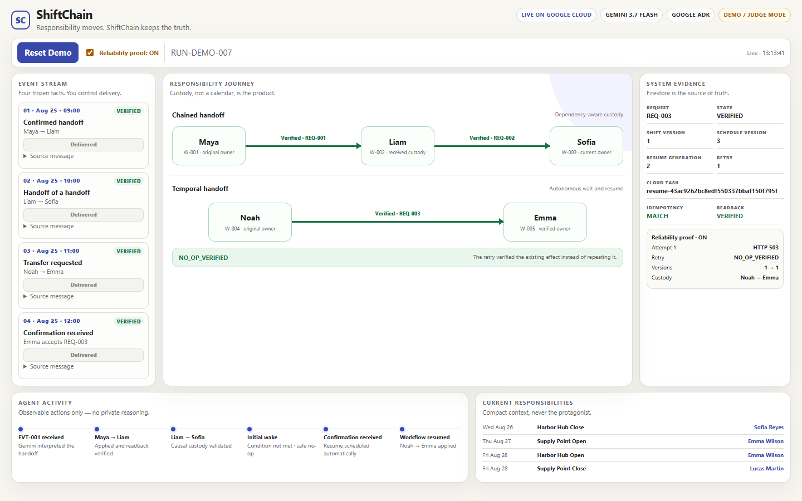
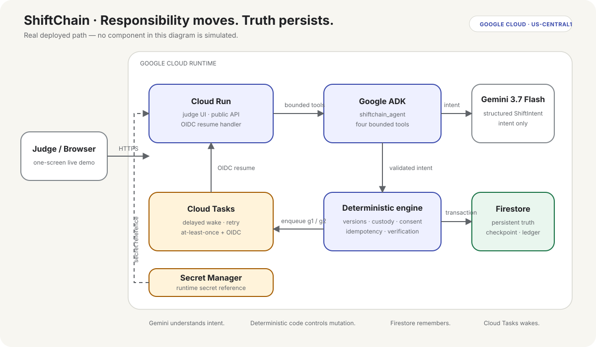
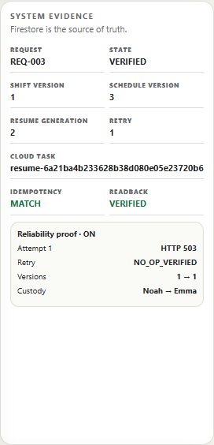

# ShiftChain

> **Responsibility moves. ShiftChain keeps the truth.**

ShiftChain is an autonomous temporal reconciliation agent that turns messy human handoffs into safe, verified responsibility changes—even when approvals arrive late or infrastructure retries the same task.

```text
Maya ──verified──▶ Liam ──verified──▶ Sofia
Noah ──waiting───▶ Emma  →  verified  →  retry-safe
```

[Live Google Cloud demo](https://shiftchain-demo-7skxzw642a-uc.a.run.app) · Gemini 3.7 Flash · Google ADK · Cloud Run · Firestore · Cloud Tasks



## The friction

Operational handoffs arrive as human language. The difficult case is not one transfer—it is a handoff of a handoff, or an approval that arrives after the workflow has paused.

ShiftChain preserves temporal custody. Liam can transfer Maya's shift to Sofia only after he owns it. Noah's transfer waits for Emma, resumes without another click, and remains safe when the same Cloud Task is delivered again.

## Why an agent

This workflow unfolds over time. It must interpret a message, validate current truth, wait, wake up, mutate persistent state, and independently verify the outcome. A chat response cannot complete that job.

The single `shiftchain_agent` uses bounded tools. Gemini understands structured intent; deterministic code owns every business decision and mutation.

## The demo story

| Event | Human fact | Observable result |
|---|---|---|
| EVT-001 | Maya and Liam approve a handoff | Maya → Liam, verified |
| EVT-002 | Liam hands the responsibility to Sofia | Maya → Liam → Sofia, verified |
| EVT-003 | Noah asks Emma to take a shift | Waiting for recipient confirmation |
| EVT-004 | Emma accepts REQ-003 | Confirmation persists; Cloud Tasks resumes automatically |

Judge Mode then returns one controlled HTTP 503 *after* Noah → Emma is committed and independently verified. The same task retries. ShiftChain reads before repeating, finds the exact effect, writes `NO_OP_VERIFIED`, and leaves every business version unchanged.

## Architecture



Editable source: [docs/architecture.mmd](docs/architecture.mmd)

Four responsibilities stay deliberately separate:

- **Gemini understands intent.** It returns a bounded `ShiftIntent`; it cannot mutate state.
- **Deterministic code controls mutation.** Preconditions, consent, custody, versions and idempotency are code.
- **Firestore holds truth.** Runs, checkpoints, custody ledger and verification evidence survive restarts.
- **Cloud Tasks handles time.** OIDC-authenticated tasks wake the workflow; generation numbers make early, stale and future delivery safe.

## Gemini and Google ADK

Gemini 3.7 Flash performs structured intent extraction only. Candidate worker, shift and request IDs are bounded before parsing, and the response must satisfy the Pydantic contract.

Google ADK runs one LLM agent with four scoped tools:

1. `read_event_context`
2. `validate_intent`
3. `apply_decision`
4. `verify_outcome`

The deterministic reconciliation engine remains authoritative even when the model output is schema-valid.

## Google Cloud

| Service | Real responsibility |
|---|---|
| Cloud Run | Hosts the judge UI, public API and protected resume handler |
| Firestore | Persistent run state, versions, checkpoints and append-only evidence |
| Cloud Tasks | Delayed and retryable autonomous resume |
| Secret Manager | Delivers the Gemini API credential without storing it in code |

The deployed demo scales from 0 to 2 Cloud Run instances and uses one queue and one named Firestore database.

## Temporal custody

Every shift has a current owner, monotonically increasing version and custody head. A transfer commit requires the expected schedule version, shift version, predecessor head, current owner, recipient availability and confirmation.

`TRANSFER_APPLIED` advances custody. `TRANSFER_VERIFIED` proves an independent readback. Verification and `NO_OP_VERIFIED` are evidence records; they never become custody edges.

## Reliability

Cloud Tasks is at-least-once infrastructure. ShiftChain does **not** assume exactly-once delivery.

The DEMO-only `LOST_ACK_AFTER_VERIFY_ONCE` fault is explicit, persisted and transactionally consumed once. It fires only after commit, readback and `VERIFIED`, then returns HTTP 503. A retry:

1. reloads Firestore;
2. finds the request already `VERIFIED`;
3. validates the applied record, verification record, versions, predecessor, owner, custody head and idempotency keys;
4. writes or observes deterministic `noop:EVT-003:g2`;
5. returns 204 without repeating the transfer.

Judge Mode intentionally simulates one lost acknowledgement after the verified business effect.



Real-cloud evidence: [Phase 3 gate](artifacts/PHASE3_GATE.md) and [reliability proof](artifacts/reliability_proof.json).

## Security

- Cloud Tasks signs the internal resume request with the dedicated task-caller identity.
- The application validates Google signature, issuer, exact audience, verified email and exact service-account identity.
- The runtime identity has only Firestore user and Cloud Tasks enqueuer at project scope, service-account use on the task caller, and accessor on the single Gemini secret.
- Deterministic request, ledger, verification and no-op IDs provide business idempotency; task headers are telemetry only.
- Secrets, tokens, raw model reasoning and service-account keys are never rendered or committed.

## Run locally

Requirements: Python 3.12, a Gemini API key for real parsing, and Google Cloud ADC only if exercising the cloud adapter.

```powershell
git clone <REPOSITORY_URL>
cd ShiftChain
py -3.12 -m venv .venv
.\.venv\Scripts\Activate.ps1
python -m pip install -e ".[dev]"

$env:GEMINI_API_KEY = "<YOUR_GEMINI_API_KEY>"
python -m shiftchain.gemini_check
python -m pytest
python -m shiftchain.demo
```

The CLI demo uses frozen structured fixtures for deterministic offline behavior. `gemini_check` is the explicit real-model check.

To run the cloud-backed web app locally, authenticate ADC and define the non-secret configuration:

```powershell
gcloud auth application-default login
$env:GOOGLE_CLOUD_PROJECT = "<YOUR_PROJECT_ID>"
$env:GOOGLE_CLOUD_REGION = "us-central1"
$env:FIRESTORE_DATABASE = "shiftchain"
$env:CLOUD_TASKS_QUEUE = "shiftchain-resume"
$env:SHIFTCHAIN_TASK_CALLER_EMAIL = "shiftchain-task-caller@<YOUR_PROJECT_ID>.iam.gserviceaccount.com"
$env:SHIFTCHAIN_SERVICE_URL = "https://<YOUR_CLOUD_RUN_URL>"
$env:SHIFTCHAIN_TASK_AUDIENCE = $env:SHIFTCHAIN_SERVICE_URL
$env:DEMO_DELAY_SECONDS = "15"
uvicorn shiftchain.web:app --host 127.0.0.1 --port 8080
```

## Deploying safely

The commands below are a reproducible outline, not an unattended production installer. Review IAM and billing in your own project.

```powershell
$PROJECT_ID = "<YOUR_PROJECT_ID>"
$REGION = "us-central1"
gcloud config set project $PROJECT_ID
gcloud services enable run.googleapis.com firestore.googleapis.com cloudtasks.googleapis.com secretmanager.googleapis.com cloudbuild.googleapis.com artifactregistry.googleapis.com

gcloud iam service-accounts create shiftchain-runtime
gcloud iam service-accounts create shiftchain-task-caller
gcloud projects add-iam-policy-binding $PROJECT_ID --member="serviceAccount:shiftchain-runtime@$PROJECT_ID.iam.gserviceaccount.com" --role="roles/datastore.user"
gcloud projects add-iam-policy-binding $PROJECT_ID --member="serviceAccount:shiftchain-runtime@$PROJECT_ID.iam.gserviceaccount.com" --role="roles/cloudtasks.enqueuer"
gcloud iam service-accounts add-iam-policy-binding "shiftchain-task-caller@$PROJECT_ID.iam.gserviceaccount.com" --member="serviceAccount:shiftchain-runtime@$PROJECT_ID.iam.gserviceaccount.com" --role="roles/iam.serviceAccountUser"

gcloud firestore databases create --database=shiftchain --location=$REGION --type=firestore-native --delete-protection
gcloud tasks queues create shiftchain-resume --location=$REGION
gcloud secrets create shiftchain-gemini-api-key --replication-policy=automatic
```

Add the Gemini key as a secret version through a protected prompt or console—never place it in shell history or a tracked file. Grant the runtime identity access only to that secret, then deploy:

```powershell
gcloud secrets add-iam-policy-binding shiftchain-gemini-api-key --member="serviceAccount:shiftchain-runtime@$PROJECT_ID.iam.gserviceaccount.com" --role="roles/secretmanager.secretAccessor"

gcloud run deploy shiftchain-demo --source . --region=$REGION --service-account="shiftchain-runtime@$PROJECT_ID.iam.gserviceaccount.com" --allow-unauthenticated --min-instances=0 --max-instances=2 --set-env-vars="GOOGLE_CLOUD_PROJECT=$PROJECT_ID,GOOGLE_CLOUD_REGION=$REGION,FIRESTORE_DATABASE=shiftchain,CLOUD_TASKS_QUEUE=shiftchain-resume,SHIFTCHAIN_TASK_CALLER_EMAIL=shiftchain-task-caller@$PROJECT_ID.iam.gserviceaccount.com,DEMO_DELAY_SECONDS=15,SHIFTCHAIN_MODEL=gemini-3.7-flash" --set-secrets="GEMINI_API_KEY=shiftchain-gemini-api-key:latest"
```

After the first deploy, set the exact Cloud Run URL and grant invoke permission to the task-caller identity:

```powershell
$SERVICE_URL = gcloud run services describe shiftchain-demo --region=$REGION --format="value(status.url)"
gcloud run services update shiftchain-demo --region=$REGION --update-env-vars="SHIFTCHAIN_SERVICE_URL=$SERVICE_URL,SHIFTCHAIN_TASK_AUDIENCE=$SERVICE_URL"
gcloud run services add-iam-policy-binding shiftchain-demo --region=$REGION --member="serviceAccount:shiftchain-task-caller@$PROJECT_ID.iam.gserviceaccount.com" --role="roles/run.invoker"
```

The public service is intentional for the judge UI; `/internal/tasks/resume` still requires and validates its exact OIDC identity.

## Tests

```powershell
python -m pytest --cov=shiftchain --cov-report=term
python -m compileall -q src tests
python -m pip check
git diff --check
```

The critical tests cover parser bounds, deterministic custody, chained dependencies, waiting/resume generations, OIDC, one-shot fault consumption, APPLIED versus VERIFIED, read-before-repeat and duplicate-free `NO_OP_VERIFIED`.

## Synthetic data

Harborlight Community Operations, every worker, shift and source message are fictional. No production workforce or institutional data is used.

## Limitations

This hackathon MVP deliberately uses one synthetic organization, four frozen demo events and a one-week responsibility context. It does not support arbitrary out-of-order events, real HR integrations, schedule generation, payroll, mobile clients or open-ended chat.

## Hackathon compliance

- Built during the contest period as a new project.
- Uses Gemini 3.7 Flash, Google ADK and Google Cloud.
- English judge UI, real hosted application, architecture diagram and reproducible setup.
- Real cloud execution and controlled reliability evidence; offline fixtures are not substituted in cloud rehearsals.
- Synthetic data and local project provenance are disclosed.
- No bonus-model integration, public repository, video upload or submission has been performed yet.

See [docs/JUDGING_MAP.md](docs/JUDGING_MAP.md), [PROJECT_PROVENANCE.md](PROJECT_PROVENANCE.md) and the phase gate artifacts for evidence.
